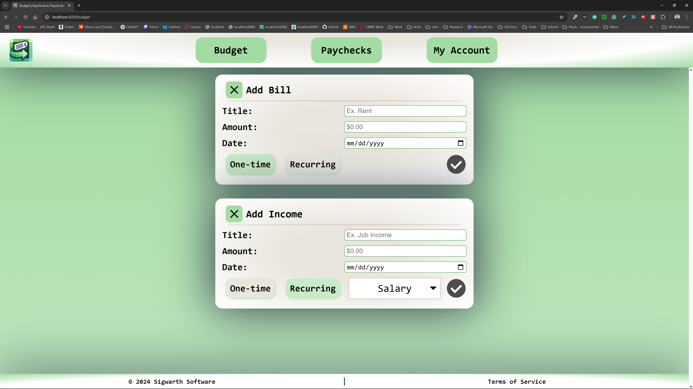
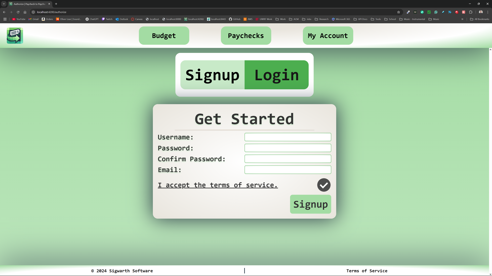
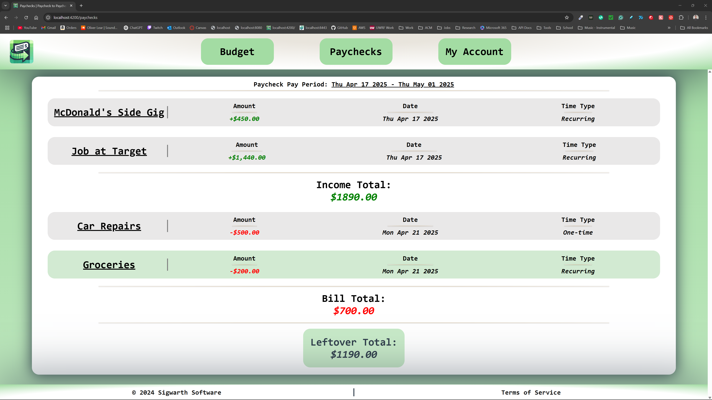
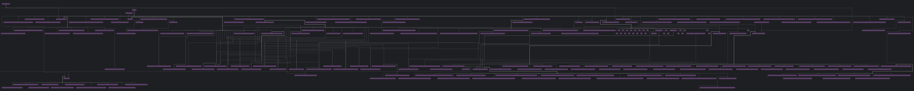

# Paycheck to Paycheck
### _An app for those to make each paycheck a little less stressful._
#### By Oliver Lear Sigwarth

---

Paycheck to Paycheck is a budgeting app to help you with your finances in a
window most people are familiar with: the time between paychecks. Knowing how
much you can spend, and when, is crutial to many people with tight budgets. At
Paycheck to Paycheck, we hope to automate this process for you so you never
have to stand in a the grocery store wondering if your card will be declined.
Our simple-to-use app will help you track your spending, when your are 
spending it, and when you are getting paid next. We hope to make your life a
little less stressful by helping you keep track of your finances.

---

## Features
- 💵 **Budgeting**: See what your income allows you to spend.
- ⌛️ **Timing**: Know when you are getting paid next, and when you can spend the
              money you have.
- 🏦 **Understand Your Holdings**: See how you can save, or pay off debt, with
                                the money you have.
- 📱 **Simple Interface**: Easy to use, easy to understand, and easy to navigate.

## Get Started

1. 🌐 Head over to the [Paycheck to Paycheck]() website. (Not yet launched)
2. 🤝 Create an account.
3. 💵 Start tracking your finances!

#### It's as easy as that!

---

## Progress

### Milestone 1 - 2/14/25

For the first milestone, I have created the structure for the project. The
stack for the project includes:

- **Frontend**: Angular
- **Backend**: Django
- **Database**: PostgreSQL with Django ORM

The project will employ an Agile methodology. Implementing this methodology 
took much of the first milestone's efforts. Below you will see how the 
Software Development Life Cycle (SDLC) will be implemented in the project.

This roadmap will be continuously updated and you can go to the projects tab
to see the latests developments.

The major developments in software can be broken down between the front-end 
and the back-end.

#### Front-end

The modular structure of Angular has been put in place. There are the 
dependencies required to make a fully-fledged web app. The beginning
components are starting to be developed. The most important components like 
the nav bar and footer have taken precedence.

The personality of website must be shown in the front-end. Knowing this, there
have been various design choices made about the look and feel of the website.
The website should have:

- Credibility
- Consistency
- Clarity

I am implementing this personality by have a soft color scheme. I am using a
color palette of soft greens and white to convey a pure and clean intention.
You can see the personality of the site with the beginnings of the web 
interface shown below.

#### Back-end

A whole lot of work is needed for the back-end. The beginning of making models
has been paramount in the first milestone. They are the backbone of our data.
Given the program is using ORM, the models are especially important in serving
a dual purpose of a back-end object and a database object. The major models 
have been started. These would include:

- User
  - Holding foreign keys and basic data
- Dates
  - Due dates
  - Recurring dates
- Income
  - One-time income
  - Recurring income
- Bills
  - One-time bills
  - Recurring bills
- Holdings
  - Debts
  - Savings
- Paychecks
  - Incorporating all the above

Given the tightly interconnected nature of the models, none can be said to be
fully complete at this time. The models are going to be continuously developed
in the beginning stages of the project.

#### Watch the Progress

Below is a video about the progress made in the first milestone.

_Or go to this [this link](https://youtu.be/vJyiV0lwHPQ) (https://youtu.be/vJyiV0lwHPQ)_

---

### Milestone 2 - 3/14/25

The second milestone was a big step forward. Between that time, about 600 
commits were added. The progress was made in both the front-end and back-end.
Look below to see the progress made in each area.

#### Both Front-end and Back-end

A massive boilerplate issue was encountered with pure HTTP requests. The 
ceasing of listening and then immediately calling for an update made it clear
that WebSockets were needed. For both the front-end and back-end, models and 
controllers were made to handle the WebSocket connections. The front-end
using Angular services and the back-end using **Django Channels**. This type 
of communication was seamlessly integrated into the app.

#### Front-end

There has been major strides in multiple components in the front-end. The 
first is the input for income and bills. Using Reactive Programming, the tree
of components takes input from the lowest level component and passes and 
refines it to the top level component. The top level component validates the
inputs and then passes them to the back-end.

Authentication, a beating heart feature for the app, was added this milestone.
Though not fully implemented, this functionality, in conjunction with session
data binding, will allow inputs like bills and income to be saved to a given 
user. As a core feature, this completion sets us up for a strong next 
milestone.

Features added:
- **Input for Income**: The user can input their income.
  - One-time income
  - Recurring income
  - Wage income
- **Input for Bills**: The user can input their bills.
  - One-time bills
  - Recurring bills
- **Authorization**: Getting user credentials and validating them.
  - Input validation
    - Filled fields
    - Valid emails
    - Matching passwords
    - Terms of service agreement
  - Signing up
    - Signup console
    - Signup WebSockets connection
  - Logging in
    - Login console
    - Login WebSockets connection
  - Authentication response
    - WebSockets return user's authentication status

##### New Components

Below you can see the UI for the newly integrated components.

##### Bill and Income Inputs

##### Authentication Consoles

#### Back-end

The back-end kept pace with the front-end during this sprint. The models for
the back-end grew more complex with new refined models. The relationships 
between users and their bills and income are now held in a single object each.

- **Bill history**: The history of bills is now held in a single object.
  - One-time bills
  - Recurring bills
- **Income history**: The history of income is now held in a single object.
  - One-time income
  - Recurring income
  - Wage income

Using Django Channels, the back-end was able to seamlessly implement two-way
communication. Controllers, or views in Django, are replaced with consumers in
Django Channels. Each entity is associated with its own consumer.

##### New Consumers

- Generic WebSocket consumer
- Auth consumers
  - Login consumer
  - Signup consumer
- Bill consumers
  - One-time bill consumer
- Income consumers
  - One-time income consumer
  - Recurring income consumer

##### Dictionary Parsing

Sending payloads from the front-end may include fields that are not 
applicable to the back-end models. To handle this, specialized dictionary
parsers were created. These parsers take the attributes of a normalize 
front-end JSON payloads, finds appropriate class fields, and creates an object
using the dictionary data.

#### Watch the Progress

Below is a video about the progress made in the second milestone.

_Or go to this [this link](https://youtu.be/n5RN0N9qiiM) (https://youtu.be/n5RN0N9qiiM)_

---

### Milestone 3 - 4/18/25

The third milestone was a massive. It took everything previous and finally 
tied it into a bow. The app now tracks, manages, and displays the web of user
data. It can dynamically determine paychecks, bills, and income. It also can 
assemble and save them using the microservice pattern. While not all UI
components are made, the app is functional. An effort still needs to be made
in terms of efficiency. Using eager fetching, in the current codebase, is
necessary, and will be replaced with lazy fetching in the future.

#### Both Front-end and Back-end

The back-end and front-end were able to work together to create a seamless
experience. With a mixed protocol of WebSockets and HTTP, the user gets the 
best of both. They get the initial session communication with HTTP and the
the dynamic updates with WebSockets. The back-end does important calculations
and slicing of data that the front-end renders. This allows for the server to
maintain context and a user to navigate the app without losing their place.

#### Front-end

This milestone, the front-end was important, but less so than the back-end. 
The front-end finally implemented the UI of paychecks. More is yet to come 
with these components, but currently, the components show:

- **Incomes**: See how much you are making.
  - One-time income
  - Recurring income
  - Wage income
- **Bills**: See where your money is going.
  - One-time bills
  - Recurring bills
- **Date**: See when you are getting paid.
  - Pay period
  - Income and bill dates
- **Time Type**: Know whether it an item affects just this paycheck or all future
paychecks.
  - One-time
  - Recurring
- **Income and Bill Totals**: See the balance in your paycheck.
- **Leftover Money**: See where your bank acount is left after the paycheck.

The interface for a user is shown like a check or paycheck stub to give a 
retro look to a modern app. You can see the line items and the totals clearly
displayed. The app is responsive and works on mobile devices no matter how 
many line items are on a given paycheck. You can see the UI below.

#### Back-end

The work done in the back-end was complex. The growing web of 
intercommunication caused dependencies to explode. Much of the time was 
managing and implementing the microservice pattern. The back-end is now 
operates is an orderly fashion. 

The tightrope of synchronous versus asynchronous communication was carefully
walked. Given how interconnected the app is and how making a method 
asynchronous affects an entire dependency tree, the care for asynchronous 
operations was needed. Asynchronous operations were implemented **only where
explicitly needed.** Since optimization is not currently a priority, and 
velocity of features is, the app selectively uses asynchronous operations.
The general fields for asynchronous operations include:

- **Database Operations**
  - Access through ORM models
  - Access through repositories
  - Access through services
- **Consumers**
  - WebSockets of all varieties
- **Views**
  - Any view that accesses any asynchronous operation

##### To Create an Entity

The pattern starts with the web app, moves to the back-end. The back-end
consumes the request. The back-end parses the request and creates an entity.
The entity is saved to the database. The saved entity is returned to the 
consumer. The consumer serializes the entity and sends it back to the 
front-end ready for display.

##### To Update an Entity

The pattern gets a request from the web app. The back-end consumes the 
requests parameters and determines which microservice to use. Once determined,
the appropriate service is called from a consumer or view. The service 
accesses the database to get the specified entity. The ORM model is parsed 
into a back-end model. The back-end model is updated with the new data. The
model is saved to the database. The success of the update is tracked and 
returned to the view or consumer. The consumer or view serializes the status
for the front-end.

Below is a graph of just some of the dependencies in the back-end. There are 
so many that text cannot fit in the diagram. Instead, you can see how the app,
and the microservice pattern, is complex and interdependent.

#### Microservice Justification

The microservice pattern was chosen because it matched a paradigm I was used 
to as well as an optimal solution pattern. The problem is that there is a lot 
of logic that is similar, but some, very important logic, that is different.
Creating services allow for the broad brush functionality of the app. The
properties of each class have specific logic, and so the repositories used for
access carefully select these entities based on their unique nature.

#### Watch the Progress

Below is a video about the progress made in the third milestone.

_Or go to [this link]()_ ()