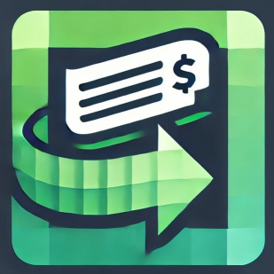
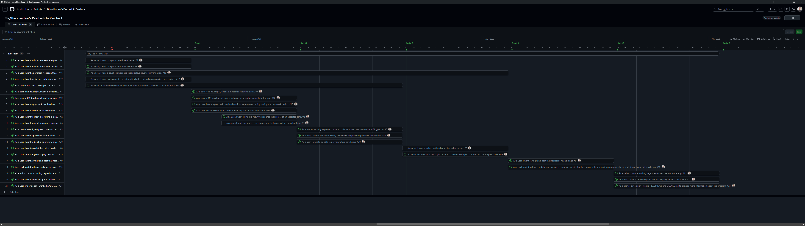
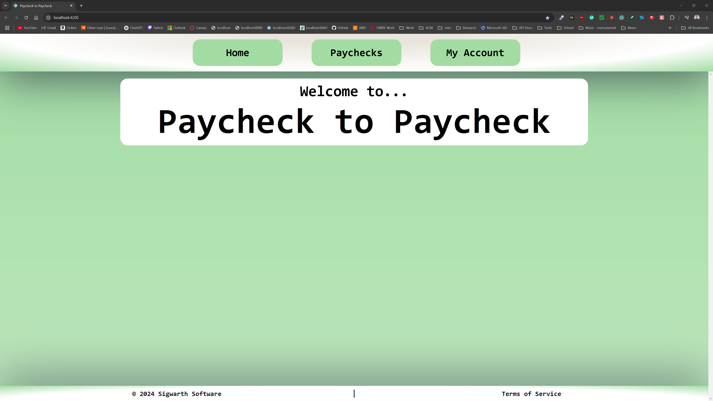

# Paycheck to Paycheck
### _An app for those to make each paycheck a little less stressful._
#### By Oliver Lear Sigwarth

---

Paycheck to Paycheck is a budgeting app to help you with your finances in a
window most people are familiar with: the time between paychecks. Knowing how
much you can spend, and when, is crutial to many people with tight budgets. At
Paycheck to Paycheck, we hope to automate this process for you so you never
have to stand in a the grocery store wondering if your card will be declined.
Our simple-to-use app will help you track your spending, when your are 
spending it, and when you are getting paid next. We hope to make your life a
little less stressful by helping you keep track of your finances.

---

## Features
- 💵 **Budgeting**: See what you income allows you to spend.
- ⌛️ **Timing**: Know when you are getting paid next, and when you can spend the
              money you have.
- 🏦 **Understand Your Holdings**: See how you can save, or pay off debt, with
                                the money you have.
- 📱 **Simple Interface**: Easy to use, easy to understand, and easy to navigate.

## Get Started

[//]: # (TODO: Create a URL on AWS.)
1. 🌐 Head Over to the [Paycheck to Paycheck]() website.
2. 🤝 Create an account.
3. 💵 Start tracking your finances!

#### It's as easy as that!

---

## Progress

### Milestone 1 - 2/14/25

For the first milestone, I have created the structure for the project. The
stack for the project includes:

- **Frontend**: Angular
- **Backend**: Django
- **Database**: PostgreSQL with Django ORM

The project will employ an Agile methodology. Implementing this methodology 
took much of the first milestone's efforts. Below you will see how the 
Software Development Life Cycle (SDLC) will be implemented in the project.

This roadmap will be continuously updated and you can go to the projects tab
to see the latests developments.

The major developments in software can be broken down between the front-end 
and the back-end.

#### Front-end

The modular structure of Angular has been put in place. There are the 
dependencies required to make a fully-fledged web app. The begining components
and beginning to be developed. The most important components like the nav bar
and footer have taken precedence.

The personality of website must be shown in the front-end. Knowing this, there
have been various design choices made about the look and feel of the website.
The website should have:

- Credibility
- Consistency
- Clarity

I am implementing this personality by have a soft color scheme. I am using a
color palette of soft greens and white to convey a pure and clean intention.
You can soo the personality of the site with the beginnings of the web 
interface shown below.

#### Back-end

A whole lot of work is needed for the back-end. The beginning of making models
has been paramount in the first milestone. They are the backbone of our data.
Given the program is using ORM, the models are especially important in serving
a dual purpose of a back-end object and a database object. The major models 
have been started. These would include:

- User
  - Holding Foreign Keys and basic data
- Dates
  - Due dates
  - Recurring dates
- Income
  - One-time income
  - Recurring income
- Bills
  - One-time bills
  - Recurring bills
- Holdings
  - Debts
  - Savings
- Paychecks
  - Incorporating all the above

Given the tightly interconnected nature of the models, none can be said to be
fully complete at this time. The models are going to be continuously developed
in the beginning stages of the project.

#### Watch the Progress

Below is a video about the progress made in the first milestone.

[//]: # (TODO: Add video link.)

_Or go to this [this link]()._